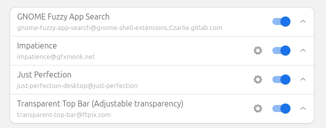

## Useful Tools
- https://github.com/symless/synergy-core (a KVM switch alternative)
- https://github.com/junegunn/fzf (fuzzy search on terminal and more!)
- https://github.com/tmux/tmux (terminal multiplexer)
    - setting: .tmux.conf file
    - cheatsheet: https://tmuxcheatsheet.com/
- https://github.com/stedolan/jq
## Alias 

```
## Switch Context and Namespace
alias set_context="source ~/.kube/set_context_v2.sh"
alias set_namespace="source ~/.kube/set_namespace_v2.sh"

## Shorthand
alias kubectl="kubectl "
complete -o default -F __start_kubectl k
```

## Gnome extension


## Useful commands
- Area screenshot and send to system clipboard
    ```
        gnome-screenshot -acf /tmp/tmp.png
    ```

- Switch multi version of a program
    ```
        update-alternatives --config java
    ```

- Remove empty dirs
    ```
    find . -empty -type d -delete
    ```

## Modify terminal behavior
- Show git branch and k8s context and namespace optionally:
    ```
    get_k8s_info_v2() {
      if [ -z "$K8S_CONTEXT" ] && [ -z "$K8S_NAMESPACE" ]; then
            echo 'empty' > /dev/null
        else
        all_info="k8s-[${K8S_CONTEXT}|${K8S_NAMESPACE}]"
        echo $all_info 2> /dev/null | sed -e 's/^/ /'
      fi
    }

    if [ -n "$force_color_prompt" ]; then
        if [ -x /usr/bin/tput ] && tput setaf 1 >&/dev/null; then
      # We have color support; assume it's compliant with Ecma-48
      # (ISO/IEC-6429). (Lack of such support is extremely rare, and such
      # a case would tend to support setf rather than setaf.)
      color_prompt=yes
        else
      color_prompt=
        fi
    fi

    if [ "$color_prompt" = yes ]; then
        PS1='${debian_chroot:+($debian_chroot)}\[\033[01;32m\]\u@\h\[\033[00m\]:\[\033[01;34m\]\w\[\033[01;32m\]$(parse_git_branch)$(get_k8s_info_v2)\[\033[00m\]\$ '
    else
        PS1='${debian_chroot:+($debian_chroot)}\u@\h:\w$(parse_git_branch)$(get_k8s_info_v2)\$ '
    fi
    unset color_prompt force_color_prompt
    ```

- Shorten terminal path
    ```
    PROMPT_DIRTRIM=2
    ```

- Cycling autocompletion 
    ```
    bind 'TAB:menu-complete'
    bind '"\e[Z":menu-complete-backward'
    ```